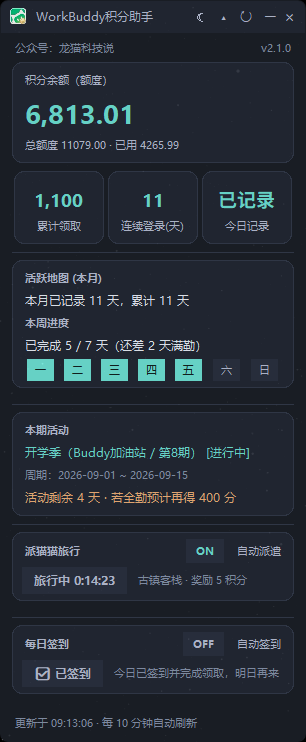
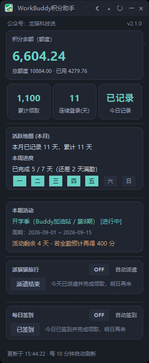
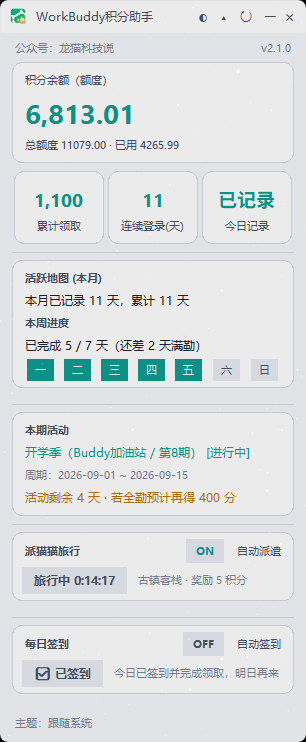
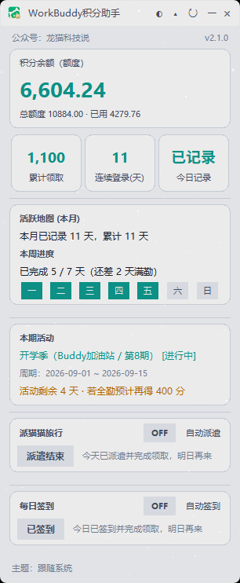

# WorkBuddy 积分助手（WorkBuddyCreditWidget）

无边框、置顶、半透明、可拖动的桌面积分挂件，实时展示 WorkBuddy 账号的签到累计积分与积分余额，支持每日签到与「派猫猫旅行」自动/手动执行，并可跨平台运行。

- 当前版本：**v2.1.0**（跨平台版）
- 适用平台：**Windows / macOS / Linux**
- 界面与 Windows 原版完全一致

---

## 功能清单

### 积分总览

- 累计领取积分（签到口径，整数）
- 积分余额（资源汇总口径，两位小数）
- 收缩态 / 展开态两种窗口形态

### 每日签到

- 手动签到：未签到显示「立即签到」，已签到显示「已签到」（无对勾）
- 自动签到开关：开启后每轮刷新未签自动签，状态持久化
- 已签到文案：「今日已签到并完成领取，明日再来」
- 未获取登录态：「无法签到」+「未获取登录凭据（请先登录WorkBuddy）」
- 签到成功发系统通知，已签不通知，无登录态通知提示登录

### 派猫猫旅行

- 手动派遣：未派遣「立即派遣」，地点随机
- 旅行中实时倒计时（每秒跳动）
- 到点「立即领取」
- 已领取「派遣结束」+「今天已派遣并完成领取，明日再来」，保持到次日
- 自动派遣开关：开启后每轮刷新未派遣且可派遣时自动派，进行中不重复派，已结束当日不再派

### 窗口与交互

- 收缩 / 展开切换、手动刷新（↻）
- 置顶、半透明（alpha 0.92）、拖动（多屏虚拟屏夹紧）
- 主题三档：auto（跟随系统）/ light / dark
- 系统托盘：Windows 左键展示窗口、右键动态菜单；macOS/Linux 菜单栏图标
- 双击复制、最小化到托盘
- 刷新策略：10 分钟自动刷新；失败 3 秒后补偿重试一次

### 配置持久化

配置目录（按平台）：

- Windows：`%APPDATA%\WorkBuddyCreditWidget\widget_config.json`
- macOS：`~/Library/Application Support/WorkBuddyCreditWidget/widget_config.json`
- Linux：`~/.config/WorkBuddyCreditWidget/widget_config.json`

字段：`theme` / `expanded` / `topmost` / `auto_checkin` / `auto_dispatch` / 窗口位置等。

---

## 快速开始

### 直接运行（源码）

需 Python 3.9+ 与 Tkinter（Linux 需 `python3-tk`）。

```bash
python workbuddy_credit_widget.py
```

首次运行前请确保本机已登录 WorkBuddy 桌面客户端（挂件通过本机登录态文件直连接口取数，不额外要求账号密码）。

### 打包

| 平台      | 脚本                    | 产物                               |
| ------- | --------------------- | -------------------------------- |
| Windows | `build_win.bat`       | `dist\WorkBuddyCreditWidget.exe` |
| macOS   | `bash build_mac.sh`   | `dist/WorkBuddyCreditWidget.app` |
| Linux   | `bash build_linux.sh` | `dist/WorkBuddyCreditWidget`     |

macOS 分发他机需 `codesign` + `notarytool` 公证（脚本含模板，详见跨平台改造文档 §4）。

---

## 技术架构

- UI：Tkinter（无边框 overrideredirect + 平台抽象层）
- 取数：登录态直连接口（Bearer token + X-User-Id），子线程取数入 queue，主线程 200ms `_tick` 轮询渲染
- 平台抽象层：主程序仅 `import platform_adapter`，按 `sys.platform` 分派后端
  - `platform_win.py`：Windows（DWM 圆角/白边、Shell_NotifyIcon、虚拟屏多屏）
  - `platform_mac.py` / `platform_linux.py` + `platform_unix.py`：macOS / Linux（pystray 可选托盘、osascript/notify-send 通知、自绘圆角近似）

```
workbuddy_credit_widget.py   # 主程序（跨平台，v2.1.0 功能基线）
acp_credit_client.py         # 积分/签到/登录态客户端（平台化：凭据路径 + 端口发现）
buddy_travel_client.py       # 派猫旅行客户端（纯标准库）
platform_adapter.py          # 平台抽象层唯一入口
platform_win.py              # Windows 后端
platform_mac.py              # macOS 后端
platform_linux.py            # Linux 后端
platform_unix.py             # mac/linux 共享底座
widget_icon.ico / widget_title_logo.png   # 图标资源
WorkBuddyCreditWidget_cross.spec          # PyInstaller spec
build_win.bat / build_mac.sh / build_linux.sh  # 打包脚本
```

### 关键接口（鉴权：Bearer accessToken + X-User-Id，来源本机 WorkBuddy 登录态文件）

- 签到状态：`POST /v2/billing/meter/checkin-activity-status`（只读）
- 积分余额：`POST /billing/meter/get-user-resource-summary`（只读，无 /v2）
- 每日签到：`POST /v2/billing/meter/daily-checkin`（写，幂等）
- 旅行状态：`GET www.workbuddy.cn/activity/growth/buddy/travel/status`（只读）
- 地点列表：`GET /activity/growth/buddy/travel/config`（只读）
- 派遣：`POST /activity/growth/buddy/travel/depart {"location_id": N}`（写）
- 领取：`POST /activity/growth/buddy/travel/claim {}`（写）

---

## 安全与只读红线

- 绝不主动触发签到/派遣/领取等写接口，除非用户点击按钮或开启对应自动开关；
- token 仅内存拼接请求头，不落盘、不打印；
- 各平台降级均为静默降级，程序绝不因平台能力缺失而崩溃。

---

## 版本历史

- **v2.1.0（跨平台版）**：平台抽象层重构，支持 Windows/macOS/Linux；签到按钮去对勾；无登录态展示「无法签到」+「未获取登录凭据」。
- **v1.2.0**：引入每日签到与派猫猫旅行（手动/自动）、旅行四态状态机、积分双口径展示、托盘/多屏/主题等完整功能；修复签到 NameError、派遣终态误判、刷新链路等历史问题。

---

## 已知限制

- Linux 无 WM 无关的系统级窗口圆角，采用自绘圆角近似；
- macOS/Linux 多屏副屏边界夹紧为主屏回退（Windows 精确）；
- macOS 分发需 Apple 开发者证书公证，否则 Gatekeeper 可能拦截；
- 托盘依赖 pystray（可选），未安装时托盘禁用但主功能正常。

## 应用图例






